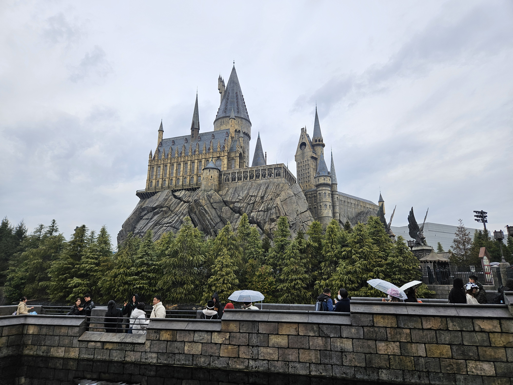
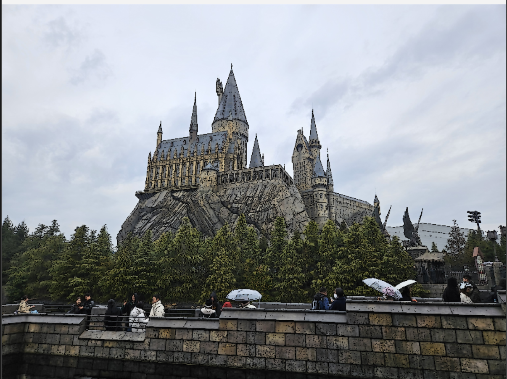

# Cartoon_maker
transfer image to cartoon image

잘 표현되는 예시
 

잘 표현되지 않는 예시
 

###한계점

밝고 윤곽선의 내,외부 사이의 대비가 큰 경우에 대해선 만화같은 표현이 잘 적용되지만 어두운 사진의 경우에는 밝기 대비가 낮아 윤곽선을 찾기가 어렵다

또한 윤곽선이 검정색으로 표현되기 때문에 윤곽선을 적용하더라도 겉으로 잘 드러나지 않는다다

